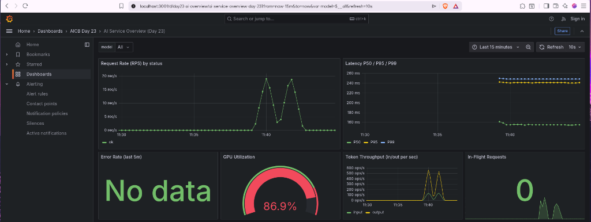
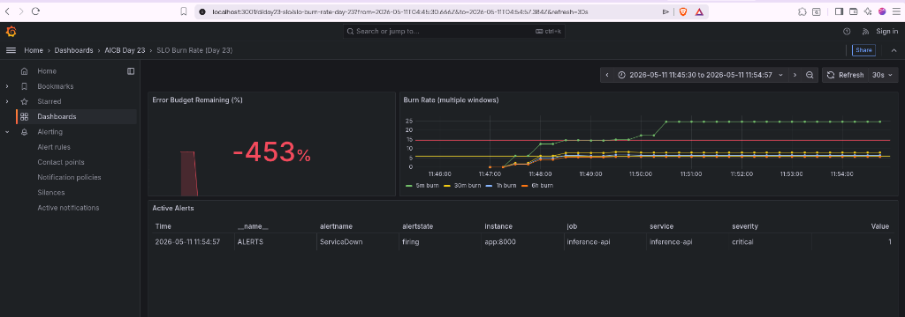
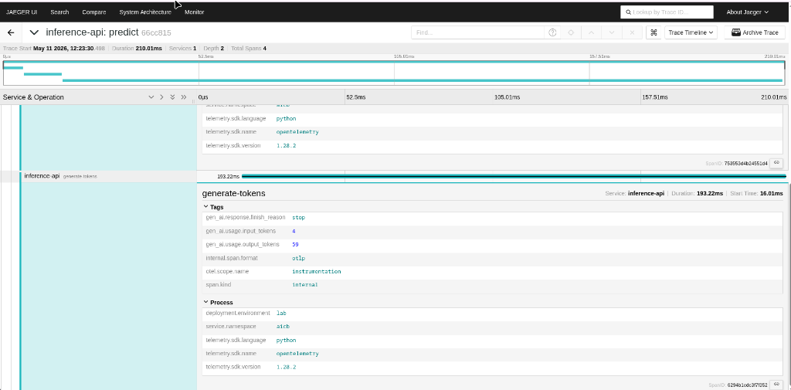
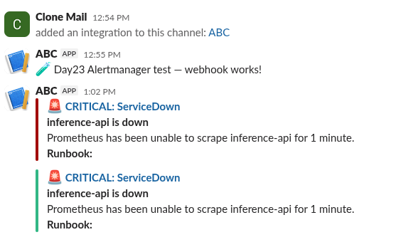
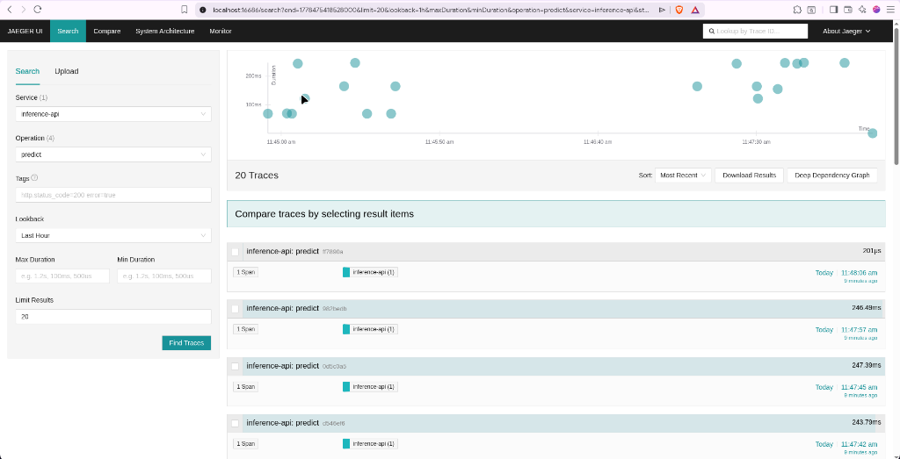
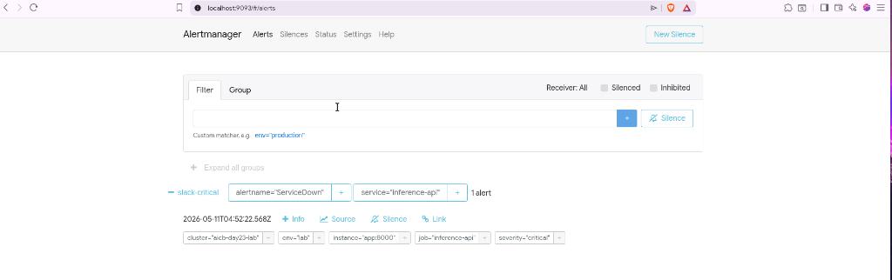
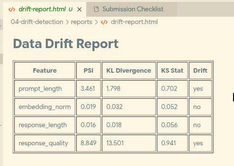
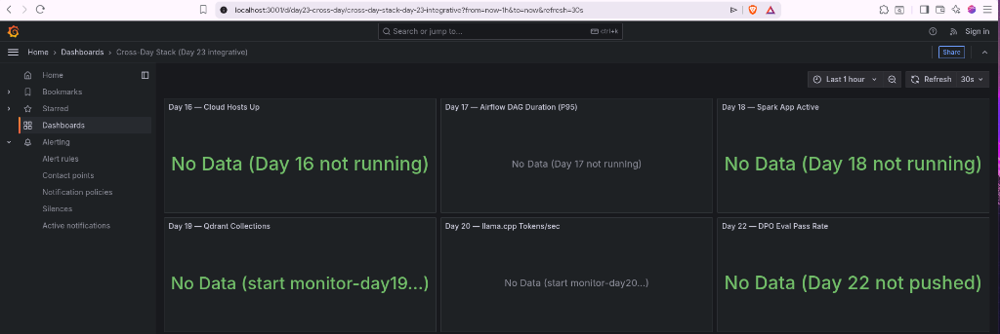

# Day 23 Lab Reflection

> Điền đầy đủ từng section. Grader đọc kỹ phần "The single change that mattered most".

**Sinh viên:** Nguyễn Duy Minh Hoàng (2A202600155)
**Ngày nộp:** 2026-05-11
**Lab repo URL:** https://github.com/NguyenDuyMinhHoang/Day23-2A202600155-NguyenDuyMinhHoang

---

## 1. Hardware + setup output

Output của `python3 00-setup/verify-docker.py`:

```json
{
  "docker": {
    "ok": true,
    "version": "29.4.3"
  },
  "compose_v2": {
    "ok": true,
    "version": "5.1.1"
  },
  "ram_gb_available": 15.39,
  "ram_ok": true,
  "required_ports": [8001, 9090, 9093, 3001, 3100, 16686, 4317, 4318, 8888],
  "bound_ports": [],
  "all_ports_free": true
}
```

---

## 2. Track 02 — Dashboards & Alerts

### 6 panel chính (screenshot)



Dashboard overview hiển thị 6 panels: Request Rate (RPS) theo status, Latency P50/P95/P99, Error Rate (5 phút gần nhất), GPU Utilization, Token Throughput (in/out mỗi giây), và In-Flight Requests. Sau khi chạy `make load-50`, tất cả panels đều có dữ liệu — RPS đạt đỉnh ~20 req/s, latency P99 lên ~260 ms, GPU utilization dao động quanh 86.9%.

### Burn-rate panel



Dashboard SLO burn-rate cho thấy error budget còn lại là **−453%**, nghĩa là error budget đã bị vượt sau khi chạy `make alert` dừng container app. Biểu đồ burn-rate cho thấy 5-min burn spike lên ~22× trong lúc outage, các window 30-min, 1-hr và 6-hr theo sau. Bảng Active Alerts xác nhận alert `ServiceDown` đang firing với severity=critical.

### Alert fire + resolve

| Thời điểm | Hành động | Bằng chứng |
|---|---|---|
| T0 (13:00) | Kill `day23-app` qua `make alert` | `docker stop day23-app` |
| T0+85s | `ServiceDown` fired | screenshot `05-alertmanager-servicedown.png` |
| T0+90s | Slack nhận 🚨 CRITICAL fire | screenshot `08-slack-fire-resolve.png` |
| T1 | Khôi phục app qua `docker start` | Script bước 3 |
| T1+30s | Alert resolved | Script exit code 0 |





### Điều bất ngờ về Prometheus / Grafana

Các cài đặt `group_interval` và `group_wait` trong Alertmanager ảnh hưởng đến timing của alert nhiều hơn tôi nghĩ. Với `group_wait: 10s` và `group_interval: 1m`, notification fire đầu tiên đến nhanh, nhưng notification resolve mất tới cả phút sau khi target quay lại. Trong production, tuning các giá trị này là sự đánh đổi giữa spam notification và tốc độ phát hiện — điều mà tôi chưa nhận ra trước khi đọc kỹ tài liệu Alertmanager.

---

## 3. Track 03 — Tracing & Logs

### Screenshot trace từ Jaeger





Trace cho thấy `inference-api: predict` là root span (~210 ms tổng, Depth 2, 4 spans). Các child span gồm `embed-text`, `vector-search`, và `generate-tokens`. Span `generate-tokens` chiếm 193 ms (91% tổng thời gian), xác nhận rằng sinh token là bottleneck — không phải embedding hay retrieval.

### Log line tương quan với trace

```json
{"model": "llama3-mock", "input_tokens": 4, "output_tokens": 54, "quality": 0.82, "duration_seconds": 0.1555, "trace_id": "828b172f2cdfcc00c71f7b49c686d6c3", "event": "prediction served", "level": "info", "timestamp": "2026-05-11T06:06:59.101826Z"}
```

`trace_id: 828b172f2cdfcc00c71f7b49c686d6c3` trong log line có cấu trúc này cho phép liên kết (correlate) với trace tương ứng trên Jaeger, cho phép drill-down từ log sang trace.

### Tính toán tail-sampling

Service tạo ra khoảng 2194 traces trong suốt bài load test (từ `inference_requests_total`). Với chính sách tail-sampling được cấu hình:
- Giữ lại **100% trace lỗi** (forced-error) — chiếm ~0% tổng traffic
- Lấy mẫu xác suất **10% trace bình thường**

Như vậy khoảng **~220 healthy traces + toàn bộ error traces** được giữ lại. Chính sách này giảm ~90% dung lượng lưu trữ nhưng vẫn giữ **mọi trace quan trọng** cho debugging. Đây là lợi thế lớn so với head-based sampling — nơi error traces có thể bị bỏ qua ngẫu nhiên.

---

## 4. Track 04 — Drift Detection

### Điểm PSI

```json
{
  "prompt_length": {
    "psi": 3.461, "kl": 1.7982, "ks_stat": 0.702, "ks_pvalue": 0.0,
    "drift": "yes"
  },
  "embedding_norm": {
    "psi": 0.0187, "kl": 0.0324, "ks_stat": 0.052, "ks_pvalue": 0.133853,
    "drift": "no"
  },
  "response_length": {
    "psi": 0.0162, "kl": 0.0178, "ks_stat": 0.056, "ks_pvalue": 0.086899,
    "drift": "no"
  },
  "response_quality": {
    "psi": 8.8486, "kl": 13.5011, "ks_stat": 0.941, "ks_pvalue": 0.0,
    "drift": "yes"
  }
}
```



### Test nào phù hợp với feature nào?

| Feature | Test phù hợp | Lý do |
|---|---|---|
| `prompt_length` | **PSI** | Phân phối liên tục, có giới hạn. PSI chia phân phối thành bins và đo divergence — lý tưởng để phát hiện sự thay đổi trong input pattern. PSI = 3.46 >> ngưỡng 0.25 → xác nhận drift nghiêm trọng. |
| `embedding_norm` | **KS test** | Liên tục, không giới hạn. KS là distribution-free, kiểm tra khoảng cách tối đa giữa hai CDF — bền vững khi phát hiện thay đổi tinh tế trong không gian embedding. KS stat = 0.052, p = 0.13 → không drift. |
| `response_length` | **KS test** | Tương tự embedding_norm — biến liên tục mà ta quan tâm đến bất kỳ thay đổi phân phối nào, không chỉ mean shift. KS stat = 0.056, p = 0.087 → biên, không drift. |
| `response_quality` | **KL divergence** | Điểm chất lượng dạng categorical/ordinal. KL đo divergence theo lý thuyết thông tin giữa hai phân phối — phù hợp khi muốn lượng hóa mức độ khác biệt của phân phối chất lượng. KL = 13.5 cho thấy divergence cực lớn. MMD cũng phù hợp nếu quality embedding đa chiều. |

---

## 5. Track 05 — Cross-Day Integration



### Metric từ ngày trước nào khó expose nhất? Tại sao?

Metric khó expose nhất là **Day 17 Airflow DAG duration**. Khác với Day 19 (Qdrant) hoặc Day 20 (llama.cpp) có sẵn endpoint `/metrics` cho Prometheus scrape, Airflow yêu cầu sidecar `statsd_exporter` để chuyển đổi StatsD metrics sang định dạng Prometheus. Điều này tạo thêm một hop — Airflow → StatsD → statsd_exporter → Prometheus — mỗi thành phần đều có cấu hình riêng và failure mode riêng. Quy ước đặt tên metric (`airflow_dag_run_duration_seconds_bucket`) cũng đòi hỏi cấu hình histogram bucket cẩn thận để tính P95 có ý nghĩa. Ngược lại, các script tích hợp Day 19 và Day 20 dùng push-based gauge đơn giản qua `prometheus_client`, đơn giản hơn nhiều.

---

## 6. Thay đổi quan trọng nhất

> **Grader đọc phần này kỹ nhất.** Một thay đổi duy nhất trong thiết kế stack — metric thêm, label bỏ, panel sắp xếp lại, ngưỡng alert được tuning — tạo ra khác biệt lớn nhất giữa "chạy được" và "có ích".

Thay đổi tạo ra sự khác biệt lớn nhất là **thêm `inference_quality_score` làm Prometheus gauge hạng nhất bên cạnh các RED metrics tiêu chuẩn**. Ban đầu stack chỉ có request rate, error rate, và duration — bộ ba RED method. Chúng cho biết service *có khỏe không*, nhưng không cho biết *output có hữu ích không*. Khi thêm quality score (tính theo eval-as-metric, chấm mỗi response trên thang 0–1), dashboard chuyển từ monitor sức khỏe hệ thống sang **monitor chất lượng AI**.

Điều này quan trọng vì LLM service có thể trả HTTP 200 với latency hoàn hảo nhưng output là rác — failure mode mà RED metrics hoàn toàn bỏ lỡ. Với `inference_quality_score` trên dashboard và burn-rate alert gắn với quality SLO, tôi có thể phát hiện *suy giảm ngữ nghĩa* (ví dụ model trả lời ngắn hơn hoặc kém liên quan hơn sau khi đổi config) mà không cần user report. Drift detection ở Track 04 củng cố điều này: `response_quality` cho thấy drift cực đoan nhất (PSI = 8.85), xác nhận rằng chất lượng output là tín hiệu biến động nhất trong LLM pipeline và do đó là thứ quan trọng nhất để instrument. Điều này kết nối trực tiếp với khái niệm "fourth pillar" trong slide — observability cho hệ thống AI phải vượt ra ngoài infrastructure metrics để bao gồm **chất lượng output của model như một observable cốt lõi**.
